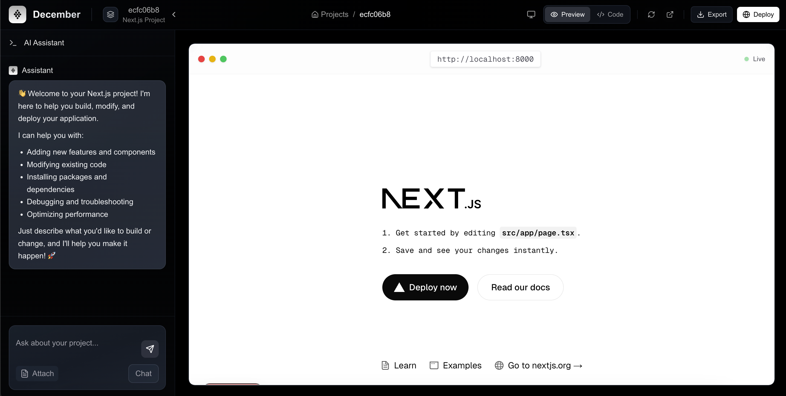

<a name="readme-top"></a>

# V0.App


A modern web application with comprehensive CI/CD pipelines and automated workflows.

## 🚀 Features

- Next.js frontend with automated deployments
- Backend services with TypeScript
- Comprehensive testing suite
- Automated repository maintenance
- Multiple build system support

## 📋 Project Structure

```
v0.app/
├── frontend/           # Next.js frontend application
├── backend/           # TypeScript backend services
└── .github/
    └── workflows/     # CI/CD and automation workflows
```

## 🔧 CI/CD Workflows

### Next.js CI/CD (`nextjs.yml`)
- 🏗️ Builds and tests Next.js application
- 📦 Exports static site
- 🚀 Deploys to both GitHub Pages and Vercel
- ✨ Includes type checking and linting

### Webpack Build (`webpack.yml`)
- 🔨 Builds NodeJS projects
- ✅ Tests across Node versions (16.x, 18.x, 20.x)
- 📤 Uploads build artifacts

### Deno Testing (`deno.yml`)
- 🧪 Runs tests and generates coverage
- 📝 Verifies code formatting
- 🔍 Performs type checking
- 📊 Uploads coverage reports

### Gulp Build (`gulp.yml`)
- 🛠️ Builds with Gulp
- 💾 Implements caching
- 🧪 Runs tests
- 📦 Uploads artifacts

### Repository Activity (`auto-activity.yml`)
- 📊 Tracks repository statistics
- 👥 Updates contributor graphs
- 🖼️ Generates social preview images
- 🤖 Auto-merges updates

## 🏃‍♂️ Getting Started

### Frontend Development
```bash
cd frontend
npm install
npm run dev
```

### Running Tests
```bash
# Frontend tests
cd frontend
npm test

# Type checking
npm run typecheck

# Linting
npm run lint
```

## 🔄 Automated Workflows

The repository includes automated workflows that:
- Build and test code on every push
- Deploy to multiple environments
- Generate statistics and reports
- Maintain repository activity
- Update documentation

## 🛠️ Technologies

- **Frontend**: Next.js, React
- **Backend**: TypeScript, Deno
- **Build Tools**: Webpack, Gulp
- **Testing**: Jest, Testing Library
- **CI/CD**: GitHub Actions
- **Deployment**: Vercel, GitHub Pages

## 📝 Environment Variables

Required secrets for deployments:

- `VERCEL_TOKEN`
- `VERCEL_ORG_ID`
- `VERCEL_PROJECT_ID`
- `WAKATIME_API_KEY` (optional)

## 👥 Contributing

1. Fork the repository
2. Create your feature branch (`git checkout -b feature/amazing-feature`)
3. Commit your changes (`git commit -m 'Add some amazing feature'`)
4. Push to the branch (`git push origin feature/amazing-feature`)
5. Open a Pull Request

## 📄 License

This project is licensed under the MIT License - see the [LICENSE](LICENSE) file for details.

## 🤝 Support

For support, please open an issue in the repository.

---
⭐️ If you find this project useful, please consider giving it a star!

<div align="center">

<h1 align="center">v0.app - Turn Ideas into Real Web Apps 🚀</h1>

  <p align="center">
    v0 is an innovative platform that transforms your ideas into functional web applications using natural language - no coding required!
    <br />
    <br />
    Simply describe what you want, and v0's intelligent agent builds it using modern frontend tools.
    <br />
    <br />
    <a href="#get-started">Get Started</a>
    ·
    <a href="https://github.com/likhonsdev/v0.app/issues/new?assignees=&labels=bug&projects=&template=bug_report.md&title=">Report Bug</a>
    ·
    <a href="https://github.com/likhonsdev/v0.app/issues/new?assignees=&labels=enhancement&projects=&template=feature_request.md&title=">Request Feature</a>

  </p>

[](LICENSE)
[](https://github.com/likhonsdev/v0.app/stargazers)
[](https://github.com/likhonsdev/v0.app/issues)

</div>
<a href="https://github.com/ntegrals/december">
    
  </a>

## ✨ Key Features

    🗣 Natural Language Interface - Describe your app in plain English
    🎨 High-fidelity UI Generation - Create UIs from wireframes or mockups
    🔄 Workflow Integration - Add functionality through simple step descriptions
    🚀 One-Click Deploy - Deploy to secure, scalable infrastructure
    🔍 Web Search & Inspection - Search and analyze web content
    🛠 Automatic Error Fixing - Intelligent diagnostics and fixes
    🔌 Tool Integration - Connect with external tools and APIs
    
## 🛠 Technical Features

    ✅ Next.js 15.3.2 with React 19 for modern frontend
    ✅ Bun + Express backend for high performance
    ✅ Containerized applications with Docker
    ✅ Full-featured Monaco code editor
    ✅ Real-time chat assistant
    ✅ Live preview with responsive design
    ✅ Project export and deployment capabilities

## Roadmap

    🔄 LLM streaming support
    🔄 Document & image attachments
    🔄 Improved fault tolerance
    🔄 Comprehensive test coverage
    🔄 Multi-framework support (beyond Next.js)

## 🚀 Get Started

1. Clone the repo

   ```sh
   git clone https://github.com/likhonsdev/v0.app.git
   cd v0.app
   ```

2. Get an API Key from any OpenAI sdk compatible provider (e.g. OpenAI, Claude, Ollama, OpenRouter, etc.) and set it in the `config.ts` file.

   The start.sh script will automatically copy over the file into the backend folder.

   I highly recommend using Sonnet-4 from Anthropic as it is the best coding model available right now.

   ```sh
    baseUrl: "https://openrouter.ai/api/v1",

    apiKey:
      "sk-...",

    model: "anthropic/claude-sonnet-4",
    temperature: 0.7,
   ```

3. Install docker (Docker Desktop is the easiest way to get started)

   - [Docker Desktop for Mac](https://www.docker.com/products/docker-desktop/)
   - [Docker Desktop for Windows](https://www.docker.com/products/docker-desktop/)
   - [Docker Engine for Linux](https://docs.docker.com/engine/install/)

   Make sure you have Docker running and the Docker CLI installed before proceeding.

4. Run the start script to set up the environment

   ```sh
   sh start.sh
   ```

5. The application will start in development mode, and you can access it at [http://localhost:3000](http://localhost:3000).

   The backend will run on port 4000, and the frontend will run on port 3000.

   You can now start building your applications with December! 🥳

<!-- ## Demo

You can test the December here: [https://december.ai](https://december.ai) -->

## 💡 Why v0?

v0 revolutionizes the way we build web applications by making development accessible to everyone. Here's what makes v0 special:

- **Natural Language Development** - Express your ideas in plain language and watch them come to life
- **End-to-End Solution** - Build both UI and backend logic, not just mockups
- **Modern Stack** - Uses cutting-edge tools like Next.js, Tailwind, and more
- **Team-Friendly** - Bridges design, product, and engineering workflows
- **Extensible** - Use your APIs, databases, and components
- **Intelligent Agent** - Autonomous capabilities including web search, site inspection, and error fixing
- **Multi-modal** - Combines code generation, web browsing, debugging, and external API interactions

## 🎯 Who is v0 for?

v0 helps teams prototype, build, and ship faster:

- **Product Managers** - Quickly prototype and validate ideas
- **Designers** - Turn mockups into real, high-fidelity UIs
- **Engineers** - Scaffold full-stack apps following best practices
- **Data Scientists** - Work with Python and SQL seamlessly
- **Marketing Teams** - Create custom landing pages quickly
- **Content Creators** - Build interactive examples and tutorials
- **Customer Support** - Develop support tools efficiently
- **Founders** - Ship MVPs fast without a large dev team

## Why run December locally?

Building applications shouldn't require expensive subscriptions or sacrificing your privacy. December gives you the power of platforms like Loveable, Replit, and Bolt without the downsides:

- **Full Control & Privacy** - Your code, ideas, and projects never leave your machine. No cloud storage, no data mining, no vendor lock-in
- **Your API Keys, Your Costs** - Use your own OpenAI API key and pay only for what you use. No monthly subscriptions or usage limits imposed by third parties
- **Complete Feature Access** - No paywalls, premium tiers, or artificial limitations. Every feature is available from day one

Most cloud-based AI development platforms charge $20-100+ per month while limiting your usage and storing your intellectual property on their servers. With December, a $5 OpenAI API credit can generate dozens of complete applications, and you keep full ownership of everything you create.

The local-first approach means you can work offline, modify the platform itself, and never worry about service outages or policy changes affecting your projects. Your development environment evolves with your needs, not a company's business model.

December proves that you don't need to choose between powerful AI assistance and maintaining control over your work. Run it locally, use your own API keys, and build without boundaries.

## 🤝 Contributing

We welcome contributions! Please see our [Contributing Guide](CONTRIBUTING.md) for details on how to:
- Submit bug reports and feature requests
- Contribute code improvements
- Improve documentation
- Share feedback and ideas

## 📫 Contact

Have questions or want to chat about v0? We'd love to hear from you!

- 🌟 [GitHub Issues](https://github.com/likhonsdev/v0.app/issues) - Bug reports and feature requests
- 🐦 Follow [@likhonsdev](https://twitter.com/likhonsdev) for updates
- 📧 Email: contact@v0.app

Thanks for being part of the v0 community! �

## Disclaimer

December, is an experimental application and is provided "as-is" without any warranty, express or implied. By using this software, you agree to assume all risks associated with its use, including but not limited to data loss, system failure, or any other issues that may arise.

The developers and contributors of this project do not accept any responsibility or liability for any losses, damages, or other consequences that may occur as a result of using this software. You are solely responsible for any decisions and actions taken based on the information provided by December.

Please note that the use of the large language models can be expensive due to its token usage. By utilizing this project, you acknowledge that you are responsible for monitoring and managing your own token usage and the associated costs. It is highly recommended to check your API usage regularly and set up any necessary limits or alerts to prevent unexpected charges.

By using December, you agree to indemnify, defend, and hold harmless the developers, contributors, and any affiliated parties from and against any and all claims, damages, losses, liabilities, costs, and expenses (including reasonable attorneys' fees) arising from your use of this software or your violation of these terms.

<!-- LICENSE -->

## License

Distributed under the MIT License. See `LICENSE` for more information.
